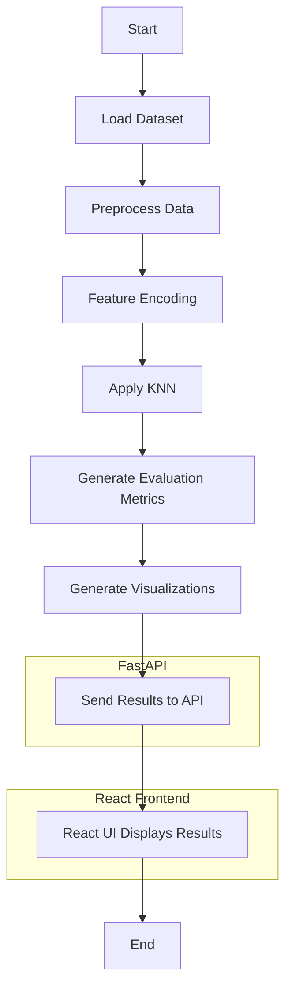

# PAI_Project: AI-Based Data Analysis and Visualization

#### Click on the link below to follow the steps to set up the project.
- [Setting Up the Project](#Setting-Up-the-Project)

## Project Overview

The **PAI_Project** is an AI-based data analysis and visualization tool that aims to provide an interactive and insightful way to explore data through machine learning models, particularly using the K-Nearest Neighbors (KNN) algorithm. This project leverages various libraries and frameworks to clean, process, and visualize data while also providing an intuitive user interface for real-time interaction.

The project consists of three main components:

1. **Analysis Module** (`analysis.py`): 
   - This file encapsulates all the logic related to data processing, machine learning, and visualization.
   - It cleans the data, applies label encoding, scales features, and applies the KNN algorithm to make predictions.
   - Various functions generate visual representations such as heatmaps, histograms, box plots, and confusion matrices.

2. **Backend API** (`app.py`): 
   - A FastAPI-based server that handles routing between the React front end and the `analysis.py` module.
   - It serves different types of graphs, model evaluations (confusion matrix, classification report, ROC curve), and data insights through RESTful endpoints.
   - It ensures smooth communication between the model and the user interface, providing images and data summaries dynamically.

3. **Frontend UI** (React):
   - The React-based user interface allows users to interact with the model, view visualizations, and explore the analysis results.
   - It makes the data accessible and presents findings through interactive charts and graphs, making complex insights user-friendly and visually engaging.


### Developers:
| Developer Name            | ID        |
| ------------------------- | --------- |
| **Abdul Rahman Azam**      | 23k-0061  |
| **Fasih Hasan**            | 23k-0018  |
| **Muhammad Owais**         | 23k-0047  |


### Key Features:

- **Data Preprocessing & Analysis**: 
  - Automatically cleans the dataset by handling missing values and outliers.
  - Encodes categorical variables using LabelEncoder and scales numerical features for better model performance.
  
- **KNN Algorithm Implementation**: 
  - Utilizes K-Nearest Neighbors to predict outcomes based on feature similarities.
  - Visualizes the model’s performance through accuracy plots, confusion matrices, classification reports, and ROC curves.

- **Dynamic Data Visualization**:
  - Generates dynamic graphs such as heatmaps, count plots, box plots, and histograms.
  - Provides insights into the relationships between features and the target variable (income, in this case).

- **Interactive Frontend**:
  - The React UI allows users to view real-time predictions, graphs, and model insights.
  - Users can explore different aspects of the data and its predictions through simple navigation.

### AI Project Flow

This flowchart illustrates the overall flow of the components and their interactions in this project.




## Setting Up the Project
1. Clone the repository:
```bash
   git clone https://github.com/fasihh/PAI_Project
   cd PAI_Project
```

2. Create a virtual environment
```bash
python -m venv venv
```

3. Activate virtual environment
```bash
venv\Scripts\activate
```

4. Install dependencies
```bash
pip install -r requirements.txt
```

5. Make a separate `.env` file from `.env.example`.

6. To start the server, you must first generate all the images:
```bash
py generate_images.py

# Then run the server using
fastapi dev app.py
```

7. Open a new terminal. Then run the following command:
```bash
npm install
```

8. To start the front-end:
```bash
npm run start
```

9. To deactivate virtual environment
```bash
deactivate
```

